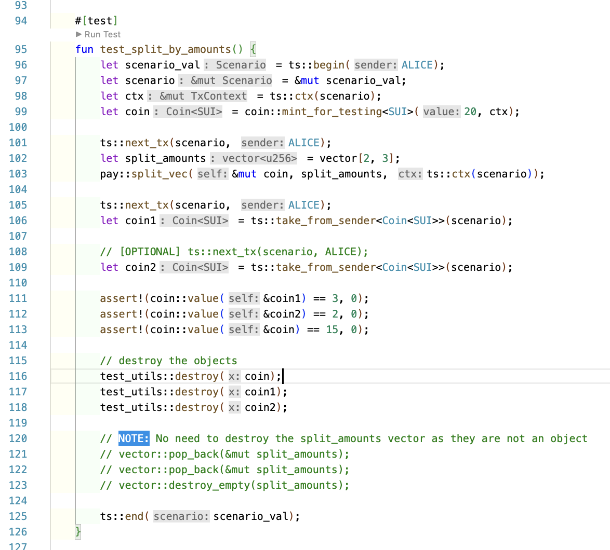

In this code example, the coin is split into multiple amounts (2 amounts i.e. a vector with 2 elements) parsed as vector (& the remaining is still in original coin object). So, effectively, there are 3 objects that are created & remains with the sender (1 original, 2 new).

**OBSERVATION**: You can see that the `next_tx` can be used only once & then all the recent objects can be popped out in reverse order (i.e. last object is taken out first).

