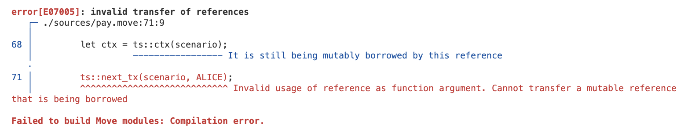
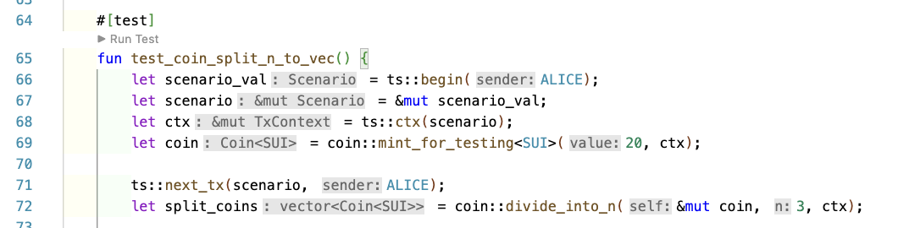
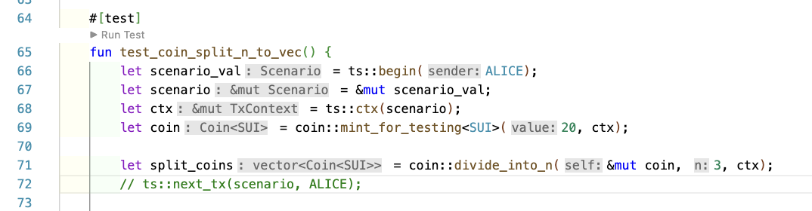
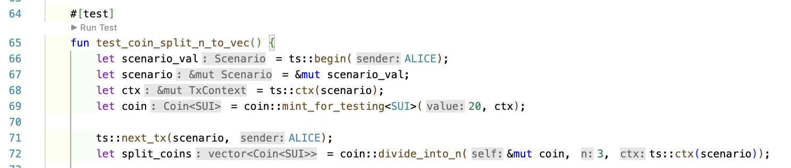

- _Cause_: In the code below, we can see the mutuable reference is being transferred from one scenario (txn) to another scenario (txn). This is not allowed in Move. So, we need to clone or re-create the `ctx`.
  

- _Solution_: Here, we recreated the `ctx` & parsed inside `divide_into_n()` function. L-72 is commented out as not required. Basically, there has to be continuous flow in single transaction or scenario.
  

  Now, if we want to run the code with `next_tx`, then use this code:
  

  > NOTE: We can move `scenario (&mut Scenario)` from one transaction to another. But, we cannot move `ctx (&mut Context)` from one transaction to another.
