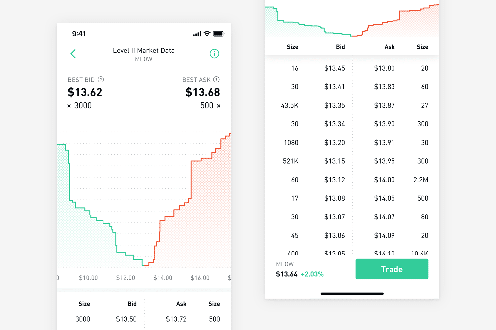

# Orderbook

  

## Overview

- **Bids** (highest to lowest) by buyer
- **Asks** (lowest to highest) by seller
- **Current price**: `bid[0]` or `ask[0]` if no trade has happened, else `last_price`
- **Order matching**: `bid >= ask`
- **Spread**: It is `|bids[0] - asks[0]|`, all the bids & asks are sorted in decreasing & increasing order respectively.

## Interface

### External Functions

- `create_bid`: if bid exists, then the next bid should only be lower than the previous bid
- `create_ask`: if bid exists, then the next ask should be higher than the previous ask

### Storage

- `bids`: `Vec<(qty, bid_price, account_id)>` ↓
- `asks`: `Vec<(qty, ask_price, account_id)>` ↑
- `last_price`: 0, if no trade has happened, else the price of the last trade
- `Trades`: `Vec<>`

## References
